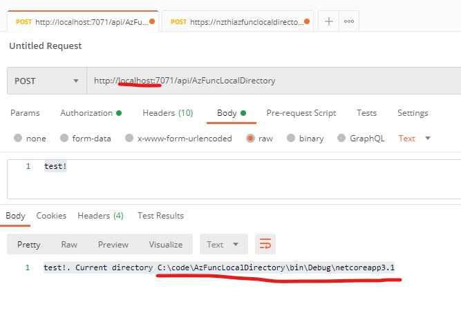
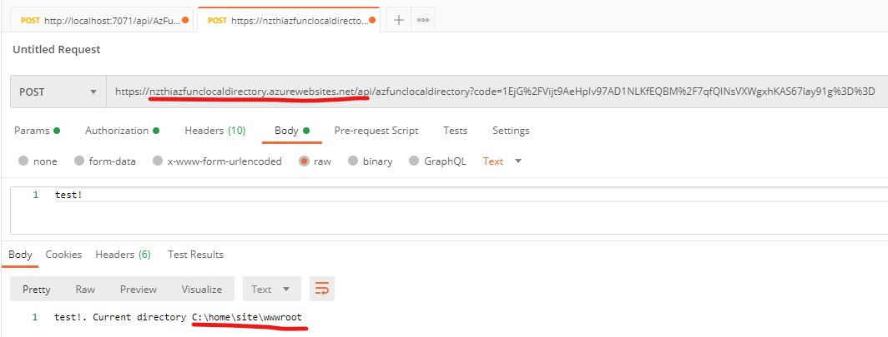

# AzFuncLocalDirectory

Getting local directory in Azure Functions using C# - use context.FunctionAppDirectory.

Add ExecutionContext context to the end of the function method declaration, and use context.FunctionAppDirectory in your code to get the current function's executing folder, as per [AzFuncLocalDirectory.cs](AzFuncLocalDirectory.cs).

Local:

Deployed:

